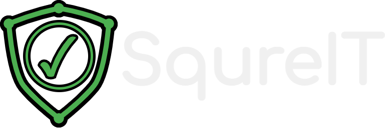

 

  

  <h3 align="center">SqureIT</h3>

  

    A cyber safety and security awareness platform focused on children and their caretakers.
     
    <a href="https://squreit.se/about"><strong>Learn More</strong></a>
     
     
    <a href="https://squreit.se">Visit Website</a>
    ·
    <a href="https://github.com/aous-al-salek/SqureIT/issues">Report Bug</a>
    ·
    <a href="https://github.com/aous-al-salek/SqureIT/issues">Request Feature</a>
  

  
Table of Contents

  <ol>
    <li>
      <a href="#getting-started">Getting Started</a>
    </li>
    <li><a href="#license">License</a></li>
    <li><a href="#contact">Contact</a></li>
  </ol>

## Getting Started

The website is easy to host by design and is primarily static and client-side.
This is done to ensure user privacy, even though some functionalities may work better otherwise.
As a result of that, some design choices may seem odd, a prime example of which is the primitive search function.
You only need a web server with PHP, Python, and the Diceware command line tool for generating passwords.

(<a href="#readme-top">back to top</a>)

<!-- LICENSE -->
## License

Distributed under the GPL-3.0 license. See `LICENSE` for more information.

(<a href="#readme-top">back to top</a>)

<!-- CONTACT -->
## Contact

Contact Page: [https://squreit.se/contact](https://squreit.se/contact)

Project Link: [https://github.com/aous-al-salek/SqureIT](https://github.com/aous-al-salek/SqureIT)

Website: [https://squreit.se](https://squreit.se)

(<a href="#readme-top">back to top</a>)

